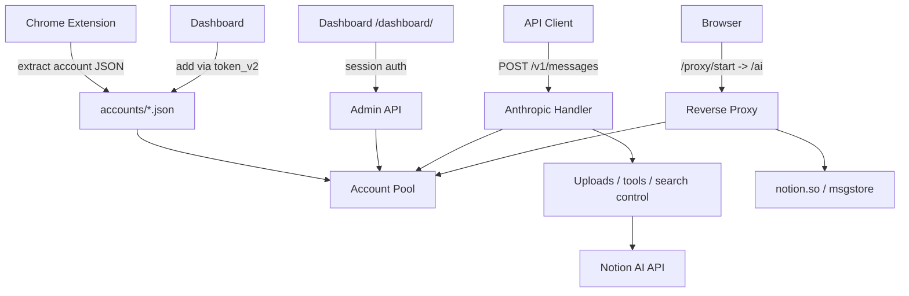

<div align="center">
  <h1>notion-manager</h1>
  <p><strong>Local account pool, dashboard, and protocol proxy for Notion AI</strong></p>
  <p>Run multiple Notion sessions behind one local entrypoint with pooled accounts, quota visibility, a browser dashboard, an Anthropic-compatible API, and Claude Code compatibility.</p>

  <p>
    
    
    
    
  </p>

  <p>
    <a href="#quick-start">Quick Start</a> •
    <a href="#core-capabilities">Core Capabilities</a> •
    <a href="#architecture">Architecture</a> •
    <a href="#full-setup-reference">Full Setup</a> •
    <a href="#documentation">Documentation</a>
  </p>

  <p>
    <strong>English</strong> |
    <a href="./README_CN.md">简体中文</a>
  </p>
</div>

---

<p align="center">
  
</p>

**notion-manager** is a local Notion AI management tool. It builds a multi-account pool, refreshes quota and model state in the background, and exposes four entrypoints:

- **Dashboard** at `/dashboard/` — manage accounts, view quota, toggle settings
- **Reverse Proxy** at `/ai` — full Notion AI web UI with pooled accounts
- **API gateway** at `POST /v1/messages`, `POST /v1/chat/completions`, `POST /v1/responses`, and `GET /v1/models` (`GET /models` alias) — compatible with Anthropic and OpenAI-style clients

## Quick Start

> **Prerequisites:** Go 1.25+, at least one Notion account. No Chrome extension needed.

```bash
# 1. Clone & run (config auto-generated on first start)
git clone https://github.com/SleepingBag945/notion-manager.git
cd notion-manager
go run ./cmd/notion-manager
```

On first run, the console prints your **admin password** and **API key** — save them.

```bash
# 2. Open the Dashboard
http://localhost:8081/dashboard/
```

**Add your first account:**

1. In Chrome, open `notion.so` → `F12` → **Application** → **Cookies** → copy `token_v2`
2. In the Dashboard, click **「+ 添加账号」** → paste `token_v2` → done

The account is auto-discovered and hot-loaded — no restart needed.

```bash
# 3. Use the API (Claude Code, Cherry Studio, curl, etc.)
export ANTHROPIC_BASE_URL=http://localhost:8081
export ANTHROPIC_API_KEY=<your-api-key>
claude  # or any Anthropic-compatible client

export OPENAI_BASE_URL=http://localhost:8081/v1
export OPENAI_API_KEY=<your-api-key>
```

Or download a pre-built binary from [Releases](https://github.com/SleepingBag945/notion-manager/releases) — no Go toolchain required.

---

## Core Capabilities

### Multi-account pool

- Load any number of account JSON files from `accounts/`
- Pick accounts by effective remaining quota instead of naive random routing
- Skip exhausted accounts automatically
- Persist refreshed quota and discovered models back into account JSON files
- Use a separate account selection path for researcher mode

### Dashboard

- Embedded React dashboard at `/dashboard/`
- Password login with session cookies
- View account status, plans, quota, discovered models, and refresh progress
- Add accounts by pasting `token_v2` — auto-discovers user info and models
- Delete accounts directly from account cards with confirmation
- Toggle `enable_web_search`, `enable_workspace_search`, and `debug_logging`
- Open the best available account or a specific account into the local proxy

### Reverse proxy for Notion Web

- Create a targeted proxy session through `/proxy/start`
- Open the full Notion AI experience locally through `/ai`
- Inject pooled account cookies automatically
- Proxy HTML, `/api/*`, static assets, `msgstore`, and WebSocket traffic
- Rewrite Notion frontend base URLs and strip analytics scripts

### API compatibility

- `POST /v1/messages` — Anthropic Messages API
- `POST /v1/chat/completions` — OpenAI Chat Completions API
- `POST /v1/responses` — OpenAI Responses API
- `GET /v1/models` — OpenAI models API
- `GET /models` — compatibility alias for `/v1/models`
- Supports both `Authorization: Bearer <api_key>` and `x-api-key: <api_key>`
- Streaming and non-streaming responses
- Anthropic `tools` and OpenAI `tools` / `function_call`
- File inputs for images, PDFs, and CSVs reuse the existing Notion upload pipeline
- Default model fallback via `proxy.default_model`
- `previous_response_id` is intentionally unsupported in `/v1/responses` (stateless bridge)

<p align="center">
  <br>
  <em>Works with <a href="https://github.com/CherryHQ/cherry-studio">Cherry Studio</a> — a multi-LLM desktop client</em>
</p>

### Claude Code Integration

Compatible with [Claude Code](https://docs.anthropic.com/en/docs/claude-code) — Anthropic's official agentic coding tool. Multi-turn tool chaining, file operations, shell commands, and extended thinking work through Notion AI via a [three-layer compatibility bridge](docs/claude-code-integration.md).

<p align="center">
  <br>
  <em>Claude Code analyzing project architecture through notion-manager — multi-turn tool chaining with session persistence</em>
</p>

<p align="center">
  <br>
  <em>Extended thinking support — Claude Code's reasoning chain is fully streamed</em>
</p>

**Setup** — just two environment variables:

```bash
export ANTHROPIC_BASE_URL=http://localhost:8081
export ANTHROPIC_API_KEY=your-api-key
claude  # start interactive session
```

**What works**: Shell commands, file read/write/edit, file search (Glob/Grep), web search, multi-turn tool chaining, extended thinking, streaming, model selection (Opus/Sonnet/Haiku).

**How it works**: Notion AI's ~27k server-side system prompt creates a strong "I am Notion AI" identity that refuses external tool calls. The proxy bypasses this by (1) dropping conflicting system prompts, (2) stripping XML control tags, and (3) reframing requests as code generation ("unit test" framing). A `__done__` pseudo-function keeps the model permanently in JSON output mode — it never switches to "respond as assistant" mode, which would trigger Notion AI identity regression. See [Claude Code Integration Details](docs/claude-code-integration.md) for the full technical explanation and [Notion's system prompt](docs/notion_system_prompt.md).

**Limitations**: Only 8 core tools (of 18+) are supported (larger tool lists break the framing), latency is higher per turn, and management tools (Agent, MCP, LSP) are filtered out.

### Research mode and search control

- Use `researcher` or `fast-researcher` as the model name
- Streams thinking blocks and final report text
- Request-level search control via `X-Web-Search` and `X-Workspace-Search`
- Search precedence is request headers > dashboard/config > defaults

## Architecture



## Full Setup Reference

### Requirements

- Go `1.25+` (or use a [pre-built binary](https://github.com/SleepingBag945/notion-manager/releases))
- At least one usable Notion account
- Chrome or Chromium (only needed for the extension workflow — the Dashboard method requires no extension)

The repo includes embedded dashboard assets, so `go run` is enough.

### Adding accounts

**Dashboard (recommended)** — paste `token_v2` in the UI, as described in [Quick Start](#quick-start).

**Chrome extension** — extracts a full config including `full_cookie`:

1. `chrome://extensions` → enable developer mode → load `chrome-extension/`
2. Open a logged-in `https://www.notion.so/`
3. Click the extension → extract config → save to `accounts/<name>.json`

### Configuration

On first run, `config.yaml` is auto-generated with a random API key and admin password. To customize:

```bash
cp example.config.yaml config.yaml
```

| Key | Notes |
|-----|-------|
| `server.port` | Listening port (default `8081`) |
| `server.api_key` | Auto-generated if empty |
| `server.admin_password` | Auto-generated if empty; plaintext is auto-hashed on startup |

### Building from source

```bash
go run ./cmd/notion-manager        # run directly
go build -o notion-manager.exe ./cmd/notion-manager  # compile binary
```

If you modify the dashboard frontend (`web/`):

```bash
cd web && npm run build        # build frontend
cp -r dist ../internal/web/    # copy to embed directory
cd .. && go build -o notion-manager.exe ./cmd/notion-manager
```

### Verify

```bash
curl http://localhost:8081/health
```

```bash
curl http://localhost:8081/v1/messages \
  -H "Authorization: Bearer <api_key>" \
  -H "Content-Type: application/json" \
  -d '{
    "model": "sonnet-4.6",
    "max_tokens": 512,
    "messages": [
      { "role": "user", "content": "Summarize what notion-manager does." }
    ]
  }'
```

## Documentation

- [API Usage](docs/api.md) — Standard requests, search overrides, file uploads, research mode
- [Dashboard & Proxy](docs/dashboard.md) — Dashboard login, proxy session workflow
- [Configuration](docs/configuration.md) — Full config reference, endpoints, notes
- [Claude Code Integration](docs/claude-code-integration.md) — How Claude Code works through Notion AI, capabilities, and limitations
- [Notion System Prompt](docs/notion_system_prompt.md) — Notion AI's full server-side system prompt (~27k tokens)

## License

This project is licensed under [CC BY-NC-SA 4.0](https://creativecommons.org/licenses/by-nc-sa/4.0/). Non-commercial use only.
