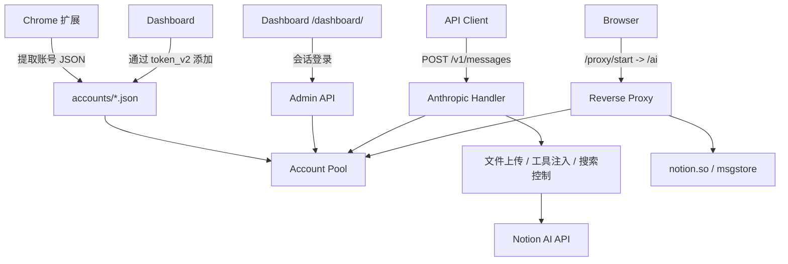

<div align="center">
  <h1>notion-manager</h1>
  <p><strong>Notion AI 多账号池、Dashboard 与本地协议代理</strong></p>
  <p>将多个 Notion 账号集中管理，通过一个本地入口实现账号池化、额度监控、API 代理、Web 代理，并兼容 Claude Code。</p>

  <p>
    
    
    
    
  </p>

  <p>
    <a href="#快速开始">快速开始</a> •
    <a href="#核心能力">核心能力</a> •
    <a href="#系统架构">系统架构</a> •
    <a href="#完整安装参考">完整安装</a> •
    <a href="#详细文档">详细文档</a>
  </p>

  <p>
    <a href="./README.md">English</a> |
    <strong>简体中文</strong>
  </p>
</div>

---

<p align="center">
  
</p>

**notion-manager** 是一个本地运行的 Notion AI 管理工具。构建多账号池，后台自动刷新额度与模型，对外提供四个入口：

- **Dashboard** `/dashboard/` — 管理账号、查看额度、切换设置
- **Reverse Proxy** `/ai` — 本地使用完整 Notion AI 页面
- **API 网关** `POST /v1/messages`、`POST /v1/chat/completions`、`POST /v1/responses`、`GET /v1/models`（`GET /models` 为兼容别名）— 同时兼容 Anthropic 与 OpenAI 风格客户端

## 快速开始

> **前置要求：** Go 1.25+，至少一个 Notion 账号。无需 Chrome 扩展。

```bash
# 1. 克隆并启动（配置首次运行自动生成）
git clone https://github.com/SleepingBag945/notion-manager.git
cd notion-manager
go run ./cmd/notion-manager
```

首次启动时控制台会打印 **管理密码** 和 **API Key** — 请务必保存。

```bash
# 2. 打开 Dashboard
http://localhost:8081/dashboard/
```

**添加第一个账号：**

1. 在 Chrome 打开已登录的 `notion.so` → `F12` → **Application** → **Cookies** → 复制 `token_v2`
2. 在 Dashboard 点击 **「+ 添加账号」** → 粘贴 `token_v2` → 完成

账号自动发现并热加载，无需重启。

```bash
# 3. 使用 API（Claude Code、Cherry Studio、curl 等）
export ANTHROPIC_BASE_URL=http://localhost:8081
export ANTHROPIC_API_KEY=<your-api-key>
claude  # 或任何 Anthropic 兼容客户端

export OPENAI_BASE_URL=http://localhost:8081/v1
export OPENAI_API_KEY=<your-api-key>
```

也可以从 [Releases](https://github.com/SleepingBag945/notion-manager/releases) 下载预编译二进制，无需 Go 工具链。

---

## 核心能力

### 1. 多账号池与自动故障转移

- 从 `accounts/` 目录加载任意数量的账号 JSON
- 按账号剩余额度优先分配请求，而不是简单随机轮询
- 账号额度耗尽后自动跳过，付费账号在后续刷新时可恢复
- 研究模式会单独选择更适合的账号，优先避开研究额度已紧张的账号
- 配额和已发现模型会持久化回写到账号 JSON

### 2. Dashboard 管理面板

- 内置 React Dashboard，入口为 `/dashboard/`
- 支持密码登录、会话维持与登出
- 查看账号详情、额度、计划类型、可用模型和刷新状态
- 通过粘贴 `token_v2` 添加账号，自动发现用户信息与模型
- 在账号卡片上直接删除账号，带确认提示
- 可触发手动刷新，并在页面内切换 `enable_web_search`、`enable_workspace_search`、`debug_logging`
- 可一键打开“最佳账号”代理，或指定某个邮箱对应的账号打开代理可实现原版对话。

### 3. 本地 Notion Web 反向代理

- 入口为 `/ai`
- 通过 `/proxy/start` 为指定账号创建会话，再进入完整的 Notion AI Web 界面
- 自动注入账号 Cookie，不需要在代理页重新登录
- 转发 Notion HTML、`/api/*`、静态资源、`msgstore` 和 WebSocket
- 会动态改写 `CONFIG.domainBaseUrl`，并过滤分析脚本

### 4. API 协议兼容层

- `POST /v1/messages` — Anthropic Messages API
- `POST /v1/chat/completions` — OpenAI Chat Completions API
- `POST /v1/responses` — OpenAI Responses API
- `GET /v1/models` — OpenAI Models API
- `GET /models` — `/v1/models` 的兼容别名
- 同时支持 `Authorization: Bearer <api_key>` 和 `x-api-key: <api_key>`
- 支持流式与非流式响应
- 同时支持 Anthropic `tools` 与 OpenAI `tools` / `function_call`
- 图片、PDF、CSV 文件输入会继续复用现有 Notion 上传链路
- 请求里未指定 `model` 时，自动回退到 `proxy.default_model`
- `/v1/responses` 暂不支持 `previous_response_id`（当前实现是无状态桥接）

<p align="center">
  <br>
  <em>兼容 <a href="https://github.com/CherryHQ/cherry-studio">Cherry Studio</a> — 多模型桌面客户端</em>
</p>

### 5. Claude Code 集成

兼容 [Claude Code](https://docs.anthropic.com/en/docs/claude-code) — Anthropic 官方的 Agentic 编程工具。多轮工具链调用、文件操作、Shell 命令和扩展思维链均可通过 Notion AI 正常工作，背后依赖[三层兼容桥接](docs/claude-code-integration.md)实现。

<p align="center">
  <br>
  <em>Claude Code 通过 notion-manager 分析项目架构 — 多轮工具链 + 会话持久化</em>
</p>

<p align="center">
  <br>
  <em>扩展思维链支持 — Claude Code 的推理过程完整流式输出</em>
</p>

**配置** — 仅需两个环境变量：

```bash
export ANTHROPIC_BASE_URL=http://localhost:8081
export ANTHROPIC_API_KEY=your-api-key
claude  # 启动交互式会话
```

**支持的能力**：Shell 命令、文件读写编辑、文件搜索（Glob/Grep）、联网搜索、多轮工具链、扩展思维链、流式输出、模型选择（Opus/Sonnet/Haiku）。

**工作原理**：Notion AI 服务端注入的 ~27k token 系统提示词赋予模型强烈的 "我是 Notion AI" 身份，会拒绝外部工具调用。代理通过三步绕过：(1) 丢弃冲突的系统提示词，(2) 剥离 XML 控制标签，(3) 将请求伪装为代码生成任务（"单元测试"framing）。`__done__` 伪函数使模型始终保持 JSON 输出模式 — 永远不切换到"正常回复"模式，避免触发 Notion AI 身份回归。详见 [Claude Code 集成技术细节](docs/claude-code-integration.md) 和 [Notion 系统提示词](docs/notion_system_prompt.md)。

**已知限制**：仅支持 8 个核心工具（原 18+ 个，更大的工具列表会破坏 framing），每轮延迟较高，管理工具（Agent、MCP、LSP）被过滤。

### 6. 研究模式与搜索控制

- 使用 `researcher` 或 `fast-researcher` 作为模型名即可触发研究模式
- 研究模式会流式输出 thinking 块和最终报告文本
- 普通模型支持联网搜索与工作区搜索
- 搜索开关优先级为：请求头覆盖 > Dashboard / `config.yaml` > 默认值

### 7. Chrome 扩展提取账号

- 扩展位于 `chrome-extension/`
- 可从当前登录的 `notion.so` 会话中提取：
  - `token_v2`
  - `full_cookie`
  - `user_id` / `space_id`
  - `client_version`
  - 当前可用模型列表
- 生成的 JSON 可直接放入 `accounts/` 使用

## 系统架构



## 完整安装参考

### 前置要求

- Go `1.25+`（或使用 [Release 预编译二进制](https://github.com/SleepingBag945/notion-manager/releases)）
- 至少一个可用的 Notion 账号
- Chrome / Chromium（仅扩展方式需要 —— Dashboard 方式无需扩展）

仓库已内嵌 Dashboard 前端资源，直接 `go run` 即可。

### 添加账号

**Dashboard（推荐）** — 在页面中粘贴 `token_v2`，详见[快速开始](#快速开始)。账号卡片底部的垃圾桶图标可删除账号。

**Chrome 扩展** — 提取包含 `full_cookie` 的完整配置：

1. `chrome://extensions` → 开启开发者模式 → 加载 `chrome-extension/`
2. 打开已登录的 `https://www.notion.so/`
3. 点击扩展 → 提取配置 → 保存到 `accounts/<名字>.json`

### 配置

首次运行时自动生成 `config.yaml`（包含随机 API Key 和管理密码）。自定义配置：

```bash
cp example.config.yaml config.yaml
```

| 配置项 | 说明 |
|--------|------|
| `server.port` | 监听端口（默认 `8081`） |
| `server.api_key` | 留空则自动生成 |
| `server.admin_password` | 留空则自动生成；明文密码启动时自动哈希 |

### 从源码构建

```bash
go run ./cmd/notion-manager        # 直接运行
go build -o notion-manager.exe ./cmd/notion-manager  # 编译二进制
```

如果修改了前端源码（`web/`）：

```bash
cd web && npm run build        # 构建前端
cp -r dist ../internal/web/    # 复制到 embed 目录
cd .. && go build -o notion-manager.exe ./cmd/notion-manager
```

### 验证

```bash
curl http://localhost:8081/health
```

```bash
curl http://localhost:8081/v1/messages \
  -H "Authorization: Bearer <api_key>" \
  -H "Content-Type: application/json" \
  -d '{
    "model": "sonnet-4.6",
    "max_tokens": 512,
    "messages": [
      { "role": "user", "content": "你好，介绍一下当前可用能力。" }
    ]
  }'
```

## 详细文档

- [API 接入](docs/api_cn.md) — 标准请求、搜索控制、文件上传、研究模式
- [Dashboard 与代理](docs/dashboard_cn.md) — 登录认证、代理会话流程
- [配置说明](docs/configuration_cn.md) — 完整配置参考、端点列表、项目结构、使用建议
- [Claude Code 集成](docs/claude-code-integration.md) — Claude Code 如何通过 Notion AI 工作、能力与限制
- [Notion 系统提示词](docs/notion_system_prompt.md) — Notion AI 服务端注入的完整系统提示词（~27k tokens）

## 许可证

本项目采用 [CC BY-NC-SA 4.0](https://creativecommons.org/licenses/by-nc-sa/4.0/) 许可证，仅限非商业用途。
